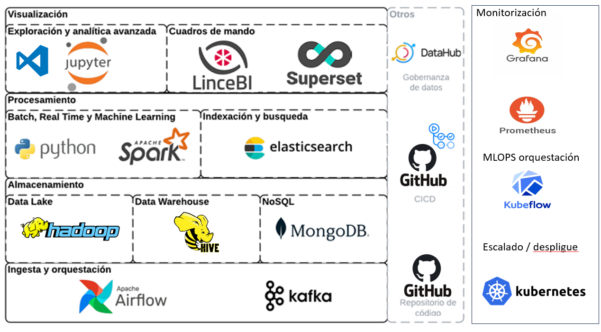

# inHadoop-Hive-Spark cluster + Jupyter on Docker

## Software

* [Hadoop 3.3.4](https://hadoop.apache.org/)
* [Hive 3.1.3](http://hive.apache.org/)
* [Spark 3.4.1](https://spark.apache.org/)

## Quick Start

To deploy the cluster, run:

```
make
docker-compose up
```

docker exec -u root -it <container_id_or_name> /bin/bash

or in terminal write  sudo su

## Access interfaces with the following URL

### Hadoop

ResourceManager: http://localhost:8088

NameNode: http://localhost:9870

HistoryServer: http://localhost:19888

Datanode1: http://localhost:9864
Datanode2: http://localhost:9865

NodeManager1: http://localhost:8042
NodeManager2: http://localhost:8043

### Spark

master: http://localhost:8080

worker1: http://localhost:8081
worker2: http://localhost:8082

history: http://localhost:18080

### Hive

URI: jdbc:hive2://localhost:10000

### HUE

http://localhost:8989

### Jupyter Notebook

URL: http://localhost:8888

example: [jupyter/notebook/pyspark.ipynb](jupyter/notebook/pyspark.ipynb)

```
docker container run -it hadoop-hive-spark-dev  bash
```

```docker
jupyter:
    image: hadoop-hive-spark-jupyter
    hostname: jupyter
    environment:
      SPARK_MASTER_HOST: 172.28.1.2
      SPARK_LOCAL_IP: 172.28.1.6
      SPARK_LOCAL_HOSTNAME: jupyter
    depends_on:
      - master
      - worker1
      - worker2
    ports:
      - "8888:8888"
    volumes:
      - ./jupyter/notebook:/home/jupyter
      - ../../Data:/landing
    restart: always
    networks:
      sparknet:
        ipv4_address: 172.28.1.6
    extra_hosts:
      - "metastore:172.28.1.1"
      - "master:172.28.1.2"
      - "worker1:172.28.1.3"
      - "worker2:172.28.1.4"
      - "history:172.28.1.5"
```

	docker build -t hadoop-hive-spark-jupyter ./jupyter 


## references:

https://marcel-jan.eu/datablog/2020/10/25/i-built-a-working-hadoop-spark-hive-cluster-on-docker-here-is-how/

hive and delta tables integration

[connectors/hive at master · delta-io/connectors · GitHub](https://github.com/delta-io/connectors/tree/master/hive)

## github with ariflow and spark

https://github.com/cordon-thiago/airflow-spark

https://medium.com/@rose4earn/docker-compose-ing-kafka-airflow-spark-b2ea66993c50

https://github.com/KumarRoshandot/AirFlow_Kafka_Spark_Docker/tree/
master#please-read-the-story-telling-first-to-understand-step-by-step-recipe-making-medium-post--

https://github.com/mrugankray/Big-Data-Cluster


## referencias

https://todobi.com/definiendo-un-data-lake-open-source/



Elements of the infra to develop to have an opensource MLOPS-DATA system

* Data Orquestation and ingest
  * Airflow
  * Kafka
* Storage
  * hadoop (HDFS)
    * hive metastore (tables)
    * Mongo DB (documents)
    * pachyderm (media files)
* Indexing and search
  * ElasticSearch
* batch, Realtime, Machine learning
  * Python
  * Spark
* Coding and DS
  * VSCode  https://github.com/coder/code-server
  * jupyter notebooks
  * pycharm
* Advance analytics
  * LinceBI
  * superset
* Control
  * DataHub (data governance)
  * Github actions (devops)
  * Github code repository
* Infra Monitoring
  * Grafana
  * Prometheus
* MLOPS life cycle control
  * Kubeflow
    * seldon core (serving)
  * mlflow
* deployment infra 
  * Kubernetes
  
- Airflow is a platform to programmatically author, schedule and monitor workflows. It allows you to orchestrate complex data pipelines using Python code. You can learn more about Airflow from its official documentation.
- 
- Kafka is a distributed streaming platform that enables you to publish and subscribe to streams of records, process them as they occur, and store them in a fault-tolerant way. It is widely used for real-time data ingestion, processing and analysis. You can find out more about Kafka from its webpage 

- Hadoop is an open source framework that allows you to store and process large-scale data sets across clusters of computers using simple programming models. It consists of several components, such as HDFS (Hadoop Distributed File System), MapReduce, YARN (Yet Another Resource Negotiator), and others. You can get started with Hadoop from its homepage.
- Hive is a data warehouse software that facilitates reading, writing and managing large datasets residing in distributed storage using SQL. It provides a metastore service that stores the schema and statistics of the tables and partitions in the warehouse. You can learn more about Hive from its wiki.
- MongoDB is a cross-platform document-oriented database that stores data in JSON-like documents with dynamic schemas. It offers high performance, scalability and flexibility for various applications. You can explore MongoDB from its website.
- Elasticsearch is a distributed, RESTful search and analytics engine that allows you to store, search and analyze large volumes of data in near real-time. It is often used as the underlying engine for applications that require complex search features and analytics. You can dive into Elasticsearch from its documentation.
- Python is a high-level, interpreted, general-purpose programming language that supports multiple paradigms, such as object-oriented, imperative, functional and procedural. It is widely used for data science, machine learning, web development and scripting. You can master Python from its official website
- Spark is a unified analytics engine for large-scale data processing. It provides APIs in Scala, Java, Python and R for performing various tasks, such as SQL queries, streaming data, machine learning and graph processing. You can discover Spark from its project page.
- VSCode is a lightweight but powerful source code editor that runs on your desktop and supports many languages and features. It has a rich ecosystem of extensions that enhance its functionality and productivity. You can download VSCode from its website.
- Jupyter Notebook is an open source web application that allows you to create and share documents that contain live code, equations, visualizations and narrative text. It is commonly used for data cleaning, transformation, analysis and visualization. You can install Jupyter Notebook from its homepage.
- PyCharm is an integrated development environment (IDE) for Python programmers. It offers many tools and features that help you write better code, such as code completion, debugging, testing, refactoring and more. You can get PyCharm from its website.
- LinceBI is an open source business intelligence platform that provides interactive dashboards, reports, charts and maps for data analysis and visualization. It supports multiple data sources, such as relational databases, OLAP cubes, CSV files and more. You can try LinceBI from its website.
- Superset is an open source data exploration and visualization platform that lets you create and share beautiful dashboards with SQL queries or drag-and-drop interfaces. It supports many types of charts, filters, annotations and more. You can use Superset from its github repository.
- DataHub is an open source metadata platform that enables you to discover, understand and trust your data assets. It provides a centralized catalog of datasets, schemas, ownerships, lineage, documentation and more. You can access DataHub from its github repository.
- GitHub Actions is a feature of GitHub that allows you to automate your software development workflows using YAML files. You can create custom workflows for building, testing, deploying, releasing and more. You can learn more about GitHub Actions from its documentation.
- GitHub is a web-based platform that hosts software development projects using Git version control system. It offers many features and services, such as code hosting, collaboration, code review, issue tracking, project management and more. You can join GitHub from its website.
- Grafana is an open source platform for monitoring and observability. It allows you to visualize, alert and explore metrics from various sources, such as Prometheus, Elasticsearch, InfluxDB and more. You can download Grafana from its website.
- Prometheus is an open source system for monitoring and alerting. It collects and stores time series data from various targets, such as applications, containers, servers and more. It also provides a powerful query language for analyzing the data and generating alerts. You can install Prometheus from its website.
- Kubeflow is an open source platform for machine learning on Kubernetes. It provides a set of tools and components that help you build, deploy and manage scalable and portable machine learning pipelines. You can start with Kubeflow from its website.
- MLflow is an open source platform for managing the end-to-end machine learning lifecycle. It offers four components: tracking, projects, models and registry. You can track experiments, package code, manage models and serve predictions with MLflow. You can use MLflow from its website.
- Kubernetes is an open source system for automating deployment, scaling and management of containerized applications. It groups containers into logical units called pods and manages them using various controllers and services. You can learn Kubernetes from its website.


**Open Source MLOps-DATA System Architecture**

The infrastructure described is a good starting point for developing an open source MLOps-DATA system. It covers the essential components of MLOps, namely:

* Data orchestration and ingest: Airflow and Kafka are popular tools for automating data pipelines and streaming data ingestion, respectively.
* Storage: Hadoop (HDFS), Hive Metastore, MongoDB, and Pachyderm are all suitable for storing different types of data, including structured, semi-structured, and unstructured data.
* Indexing and search: Elasticsearch is a powerful search engine that can be used to index and search all types of data.
* Batch, real-time, and machine learning: Python and Spark are popular programming languages and frameworks for data processing and machine learning.
* Coding and DS: VSCode, Jupyter Notebooks, and PyCharm are all popular IDEs for coding and data science.
* Advanced analytics: LinceBI and Superset are open source business intelligence tools that can be used to perform advanced analytics on data.
* Control: DataHub, GitHub Actions, and GitHub Code Repository can be used for data governance, DevOps, and code management.
* Infrastructure monitoring: Grafana and Prometheus are popular tools for monitoring infrastructure and applications.
* MLOps lifecycle control: Kubeflow and MLflow are popular open source platforms for managing the MLOps lifecycle.
* Deployment infrastructure: Kubernetes is a popular container orchestration platform that can be used to deploy machine learning models and applications.

**To develop an open source MLOps-DATA system, you would need to integrate these components into a cohesive platform.** This would involve developing APIs and connectors to allow the different components to communicate with each other. You would also need to develop documentation and tutorials to help users get started with the platform.

**Here are some specific steps you could take to develop an open source MLOps-DATA system:**

1. **Choose a development framework.** There are a number of open source frameworks available for developing MLOps platforms, such as Kubeflow Pipelines and MLflow. Choose a framework that meets your specific needs and requirements.
2. **Develop a data pipeline.** Use Airflow and Kafka to automate the process of ingesting, processing, and storing data.
3. **Develop a model training pipeline.** Use Python and Spark to train machine learning models on your data.
4. **Develop a model serving pipeline.** Use Kubeflow and Seldon Core to deploy and serve machine learning models to production.
5. **Develop a monitoring pipeline.** Use Grafana and Prometheus to monitor the performance of your data pipelines and machine learning models.
6. **Develop a governance framework.** Use DataHub to establish data governance policies and procedures.
7. **Develop documentation and tutorials.** Help users get started with your platform by developing comprehensive documentation and tutorials.

**Once you have developed the core components of your platform, you can release it as an open source project.** This will allow other users to contribute to the platform and improve it over time.

**Here are some additional considerations for developing an open source MLOps-DATA system:**

* **Modularity.** Design your platform in a modular way to make it easy to add new features and integrations.
* **Scalability.** Make sure your platform can scale to meet the needs of large and complex machine learning projects.
* **Security.** Implement security measures to protect your platform from unauthorized access and malicious attacks.
* **Community engagement.** Actively engage with the community to get feedback and contributions.

**By following these steps, you can develop an open source MLOps-DATA system that is powerful, scalable, and secure.**

